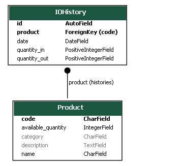

<h1 align="center">
    
</h1>


## 🤖 Tecnologias

Esse projeto está sendo desenvolvido com as seguintes tecnologias:

- [Django](https://www.djangoproject.com/)
- [Django-Rest-Framework](https://www.django-rest-framework.org/)
- [Celery](https://docs.celeryq.dev/en/stable/)
- [Redis](https://redis.io/)
- [React](https://reactjs.org)

## Projeto
Simples projeto de estoque de uma papelaria

<div align="center">
    
</div>
<p align="center">Models</p>
<hr>

## Instalação

### Pré requisitos

Ter instalado:
- [Redis](https://redis.io/)
- [Python](https://www.python.org/downloads/)
- [Node](https://nodejs.org/en/download/)
- [Yarn](https://classic.yarnpkg.com/en/docs/install/)

### Redis (em um terminal, rodar)
```sh
redis-server
```

### Backend
```sh
# Entrar na pasta dos arquivos do backend
cd backend

# Renomear .env_example para .env
cp .env_example .env
# ADICIONE OS VALORES CORRETOS

# Criar um ambiente virtual
python -m venv venv

# Ativar o ambiente virtual
. activate.sh
# ou . venv/Scripts/activate
# ou . venv/bin/activate
# ou source venv/Scripts/activate

# Instalar os pacotes necessários
pip install -r requirements.txt

# Executar as migrações
python manage.py migrate

# Criar superusuário (poderá fazer login e entrar no admin)
. create_su.sh

# Run
. run.sh
```

### Celery (em um terminal, rodar)
```sh
. celery.sh
```

### Frontend (em um terminal, rodar)
```sh
# Entrar na pasta dos arquivos do frontend
cd web

# Renomear .env_example para .env
cp .env_example .env
# ADICIONE OS VALORES CORRETOS

# Instalar os pacotes do projeto
yarn install

# Rodar
yarn start
```

## Screens
<div align="center">
    
</div>
<p align="center">Screen 1</p>
<hr>

<div align="center">
    
</div>
<p align="center">Screen 2</p>
<hr>

<div align="center">
    
    
</div>
<p align="center">Screens 3 and 4</p>
<hr>

<div align="center">
    
</div>
<p align="center">Screen 5</p>
<hr>
